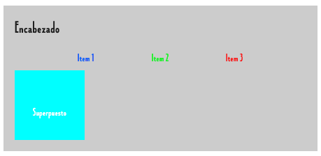

---

## 📌 **Equivalencias entre Jetpack Compose y XML**  

| XML (View System)  | Jetpack Compose (Modifiers) | Descripción |
|---------------------|--------------------------|-------------|
| `fill_parent` (deprecated) / `match_parent` | `Modifier.fillMaxSize()` | Hace que el componente ocupe todo el espacio disponible del padre (tanto ancho como alto). |
| `wrap_content` | `Modifier.wrapContentSize()` | Hace que el componente se ajuste al contenido interno sin ocupar más espacio del necesario. |
| `match_parent` en un solo eje (`android:layout_width="match_parent"`) | `Modifier.fillMaxWidth()` | Ocupa todo el ancho disponible del padre. |
| `match_parent` en altura (`android:layout_height="match_parent"`) | `Modifier.fillMaxHeight()` | Ocupa todo el alto disponible del padre. |

---

## 🎯 **Views y Equivalencias**
| Jetpack Compose | XML Tradicional |
|-----------------|----------------|
| `Box` | `FrameLayout` |
| `Row` | `LinearLayout (horizontal)` |
| `Column` | `LinearLayout (vertical)` |
| `ConstraintLayout` | `ConstraintLayout` |
| `LazyColumn` | `RecyclerView (vertical)` |
| `LazyRow` | `RecyclerView (horizontal)` |
| `FlowRow` | `FlexboxLayout (horizontal wrap)` |
| `FlowColumn` | `FlexboxLayout (vertical wrap)` |
| `Scaffold` | `CoordinatorLayout + AppBarLayout + FAB` |

---


Aquí tienes dos ejemplos detallados para el **Ejercicio 1: Contenedores en Jetpack Compose**.  

## ✅ **Ejemplo Básico: Uso de `Column`, `Row` y `Box`**
📌 **Objetivo:** Crear una pantalla simple con un `Column`, que contenga un `Row` con tres elementos de texto y un `Box` para superponer contenido.

```kotlin
@Composable
fun BasicLayoutExample() {
    Column(
        modifier = Modifier
            .fillMaxSize()
            .background(Color.LightGray)
            .padding(16.dp)
    ) {
        Text(
            text = "Encabezado",
            fontSize = 24.sp,
            fontWeight = FontWeight.Bold,
            modifier = Modifier.padding(bottom = 8.dp)
        )

        Row(
            modifier = Modifier
                .fillMaxWidth()
                .padding(8.dp),
            horizontalArrangement = Arrangement.SpaceEvenly
        ) {
            Text(text = "Item 1", color = Color.Blue)
            Text(text = "Item 2", color = Color.Green)
            Text(text = "Item 3", color = Color.Red)
        }

        Box(
            modifier = Modifier
                .size(100.dp)
                .background(Color.Cyan)
                .padding(top = 16.dp)
        ) {
            Text(
                text = "Superpuesto",
                modifier = Modifier.align(Alignment.Center),
                color = Color.White,
                fontWeight = FontWeight.Bold
            )
        }
    }
}
```



🔹 **Explicación:**  
- `Column` organiza los elementos verticalmente.  
- `Row` alinea elementos en horizontal y los distribuye equitativamente con `Arrangement.SpaceEvenly`.  
- `Box` permite superponer elementos; aquí colocamos un `Text` en el centro.  

---

## 🔥 **Ejemplo Complejo: Uso de `ConstraintLayout`**
📌 **Objetivo:** Crear un diseño donde los elementos estén alineados con restricciones, similar a un **RelativeLayout** en XML. (ConstraintLayout solo compatible con Android)

```kotlin
@Composable
fun ComplexLayoutExample() {
    ConstraintLayout(
        modifier = Modifier
            .fillMaxSize()
            .padding(16.dp)
    ) {
        // Referencias
        val (header, row, box1, box2) = createRefs()

        Text(
            text = "Título Principal",
            fontSize = 24.sp,
            fontWeight = FontWeight.Bold,
            modifier = Modifier.constrainAs(header) {
                top.linkTo(parent.top)
                start.linkTo(parent.start)
                end.linkTo(parent.end)
            }
        )

        Row(
            modifier = Modifier
                .fillMaxWidth()
                .padding(top = 16.dp)
                .constrainAs(row) {
                    top.linkTo(header.bottom)
                    start.linkTo(parent.start)
                    end.linkTo(parent.end)
                },
            horizontalArrangement = Arrangement.SpaceAround
        ) {
            Text(text = "Opción A", color = Color.Blue)
            Text(text = "Opción B", color = Color.Green)
            Text(text = "Opción C", color = Color.Red)
        }

        Box(
            modifier = Modifier
                .size(100.dp)
                .background(Color.Cyan)
                .constrainAs(box1) {
                    top.linkTo(row.bottom, margin = 16.dp)
                    start.linkTo(parent.start)
                }
        ) {
            Text(
                text = "Caja 1",
                modifier = Modifier.align(Alignment.Center),
                color = Color.White
            )
        }

        Box(
            modifier = Modifier
                .size(100.dp)
                .background(Color.Magenta)
                .constrainAs(box2) {
                    top.linkTo(row.bottom, margin = 16.dp)
                    end.linkTo(parent.end)
                }
        ) {
            Text(
                text = "Caja 2",
                modifier = Modifier.align(Alignment.Center),
                color = Color.White
            )
        }
    }
}
```

🔹 **Explicación:**  
- `ConstraintLayout` organiza elementos con restricciones similares a `RelativeLayout`.  
- `createRefs()` crea referencias para los elementos.  
- `constrainAs(...)` permite alinear elementos con reglas como `top.linkTo(...)` o `start.linkTo(...)`.  

---

💡 **Diferencias entre los Ejemplos:**  
- **El básico** usa `Column`, `Row` y `Box`, adecuados para layouts simples.  
- **El complejo** usa `ConstraintLayout`, útil para interfaces más sofisticadas y alineaciones precisas.  

¿Quieres que agregue más variantes o mejoras? 🚀